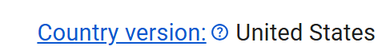
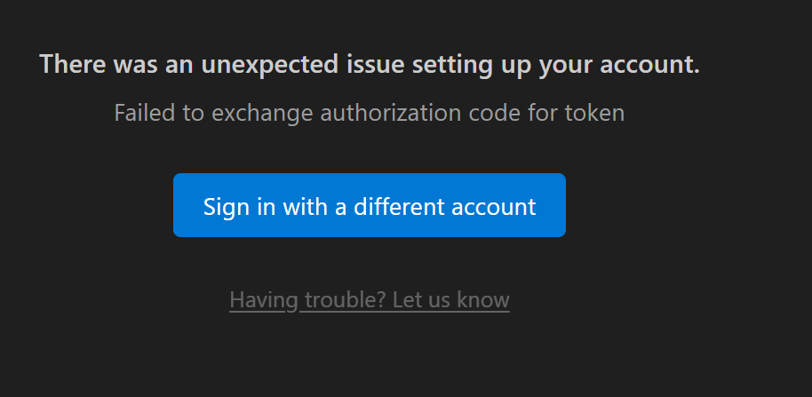
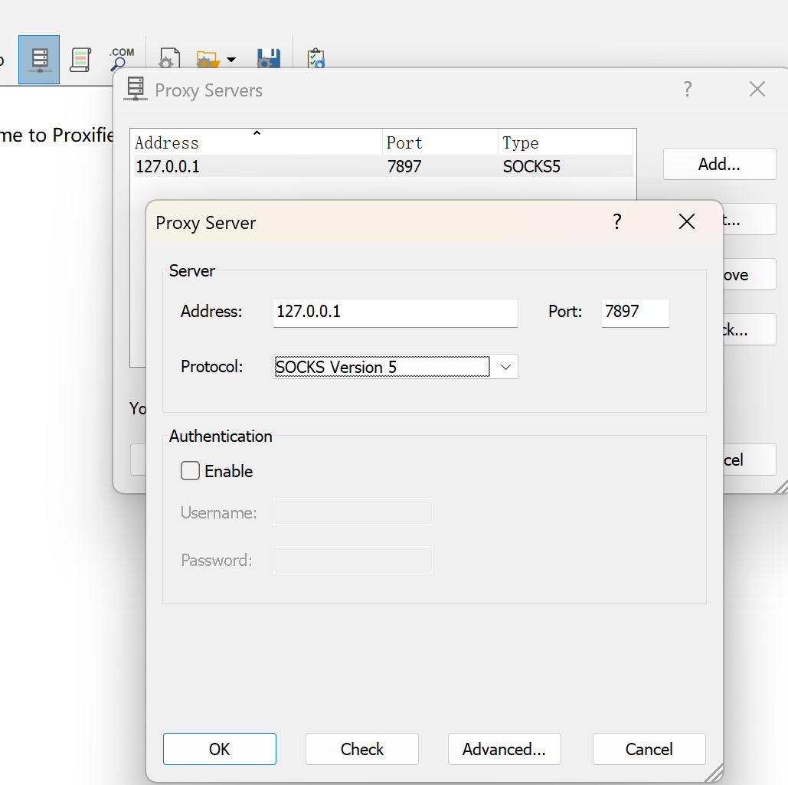
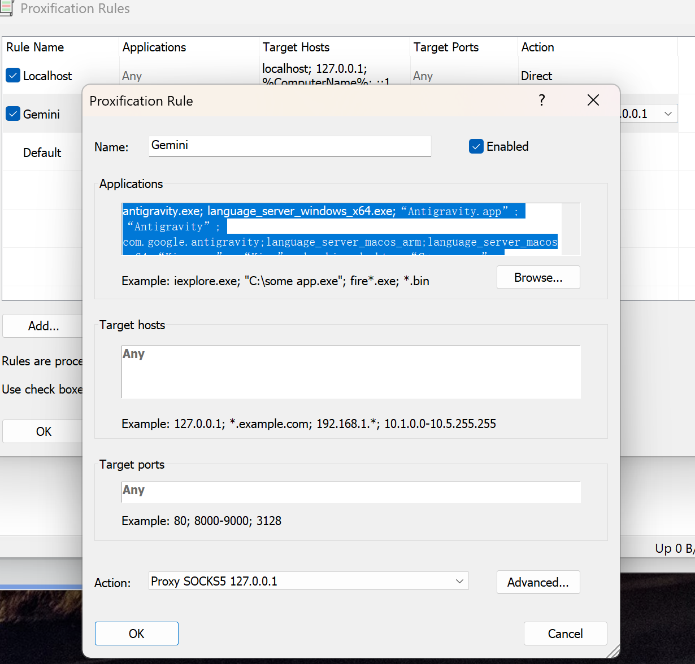

## 2026-3-4/tips

开始前，思考一个小问题。

假设HPV的实际发病率为0.01%。

如果一个人真为阳性，有99.99%概率检查出来；

如果一个人真为阴性，也有99.99%概率检查出来。

那么，一个人检查为阳性，那么真实为阳性的概率是多少？

|           | 实际阳性T       | 实际阴性F        |      |
| --------- | --------------- | ---------------- | ---- |
| 检测阳性P | 0.01%×99.99% TP | 99.99%×0.01% FP  |      |
| 检测阴性N | 0.01%×0.01% TN  | 99.99%×99.99% FN |      |
|           | 0.01%           | 99.99%           | 1    |

现在要求什么？求 TP/(TP+FP)=50%

## Antigravity本地部署

### 过程中需要下载的有

> 1. 一个魔法翻墙功能工具（CuteCloud等）
> 2. Proxifier：[Proxifier下载](https://www.proxifier.com/)
> 3. Antigravity：[Antigravity](https://antigravity.google/download?hl=zh-cn)
> 4. 准备一个google账号。

### 1.Antigravity的安装和使用

[Antigravity下载链接](https://antigravity.google/download?hl=zh-cn)

[安装流程参考](https://blog.csdn.net/2301_78677192/article/details/157365076)

1. 安装exe文件（本人windows11系统），安装时按默认配置确认。安装目录可自行修改，无影响。
2. 点击程序开始使用。仍可以按照默认配置确认。
3. 到登陆谷歌账号这一步，大部分人会卡住。

#### 2. google账号的处理

[google账号处理参考](https://zhuanlan.zhihu.com/p/1994177101742507842)

[google账号处理2](https://jishuzhan.net/article/1996450270851694593)

你的google账号认证地址最好是美国（中国大陆、香港地区等不行）才能登陆上去。

1. [查看谷歌账号认证地址](https://policies.google.com/terms)
2. [修改谷歌认证地址](https://policies.google.com/country-association-form)。国家选择united states，地区选择加利福尼亚，原因选其他。然后说因为学习原因搬到了加利福尼亚。

回到上面的步骤，如果还是登陆不上去，比如出现了下面的问题（其他问题更容易搜到解决办法），下面就涉及到最后一个软件的使用。

#### 3. Proxifier使用

[Proxifier破解注册与处理参考](https://linux.do/t/topic/1190670)

1. [Proxifier下载](https://www.proxifier.com/)

2. 魔法工具开启TUN模式，并查看port端口号

3. 打开proxifier，点击proxy server-add，按照下图新建。最后记得确认

   

4. 随后点击rules-add，最后记得保存。

   - name命名gemine(都可以)
   - applications:`antigravity.exe; language_server_windows_x64.exe;“Antigravity.app”; “Antigravity”; com.google.antigravity;language_server_macos_arm;language_server_macos_x64;“Kiro.app”; “Kiro”; dev.kiro.desktop;“Cursor.app”; “Cursor”; com.todesktop.230313mzl4w4u92`
   - action:刚刚创建的127.0.0.1

到这里一般就可正常使用了。

