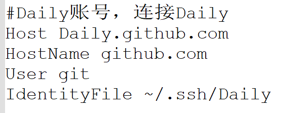

-----

### **因为经常遇到想要建立github仓库但是弄不清楚SSH密钥、本地分支如何操作等的情况，这次趁着整理过去资料的机会，下定决心弄清相关问题，并记录下来。**

------------

## 一.Github新建仓库

1. 到右上角“+”处，选择新建仓库。

   

2. 参考下面内容创建仓库

   

3. 创建成功

   分别能看到仓库名、当前分支、初始化的README.md文档和内容等。

   

## 二.创建SSH密钥对

1. 本地创建SSH密钥对

   **使用ssh-keygen命令创建密钥对**，示例如下

   ```bash
   $ ssh-keygen -t rsa -b 4096 -C "your_email@exmple.com" -f file_name
   ```

   各个参数解释如下：

   - -t:指定密钥类型，有dsa[^dsa注]、rsa、ecdsa、ed25519,一般情况使用rsa，缺省为rsa
   - -b:指定密钥长度，示例中4096
   - -C:设置注释文字，如邮箱
   - -f:指定密钥文件名，缺省为id_rsa

   **接着会提示设计密码（push文件时单独使用），此处可直接回车两次**

   **到此密钥创建成功，可在~/.ssh目录下查看相关文件**

2. 本地配置密钥config

   到~/.ssh目录下，可以看到所有的ssh密钥对

   你需要配置“config”文件，**使你不同的仓库使用不同的密钥，进一步保证安全**

   这是其中一个仓库的配置。

   

   - Host 是自定义的别名
   - IdentityFile 是密钥路径
   - HostName 指定github.com
   - User 表示使用git

   User和HostName组合，表示使用 git@github.com

3. 本地激活密钥

   创建密钥对后，需要将私钥加入ssh-agent(不激活，远程添加的ssh无法使用，会使用之前配置好的ssh)

   首先启动ssh代理

   ```bash
   $ eval "$(ssh-agent -s)"
   > Agent pid xxxxx 
   ```

   随后将私钥加入(示例私钥文件为“Daily”)

   ```bash
   $ ssh-add ~/.ssh/Daily
   ```

4. 远程添加公钥

   到Github的setting中，找到“SSH and GPG keys”,点击“New ssh key”添加密钥

   

   Tile建议按照仓库命名，type默认“Authentication Key”

   Key是把对应的公钥放进去，如Daily.pub的内容

5. 测试

   打开git bash，输入下面内容测试连接

   ```bash
   $ ssh -T git@Daily.github.com  （就是Host）
   ```

   成功连接后显示下面内容

   

[^dsa注]:github目前不支持dsa

## 三.创建本地仓库，添加相关分支

新建的文件夹需要与远程仓库连接，并创建对应分支。

每个文件夹的初次操作流程如下：

1. 初始化

   ```bash
   git init
   ```

2. 与远程仓库建立联系

   ```bash
   git remote add origin git@github.com:UNILkx/Daily.git
   ```

3. 本地切换分支

   ```bash
   git checkout -b dir_name
   ```

   dir_name为文件夹名字

4. git add  初始化需要的文件

   ```bash
   git add . /(或者) file_name
   ```

    看个人情况确定加文件

5. git commit 

   ```bash
   git commit -m "add:xxxxx"
   ```

6. git push 并远程创建与本地

   ```bash
   git push --set-upstream origin dir_name
   ```

   

## 参考

[github配置SSH密钥](https://knowledge-things.github.io/2023/02/15/github-pei-zhi-ssh-mi-yao/#%E5%90%91%E4%BD%A0%E7%9A%84%E5%B8%90%E6%88%B7%E6%B7%BB%E5%8A%A0%E6%96%B0%E7%9A%84-SSH-%E5%AF%86%E9%92%A5)

[git使用教程](https://zhuanlan.zhihu.com/p/30044692)