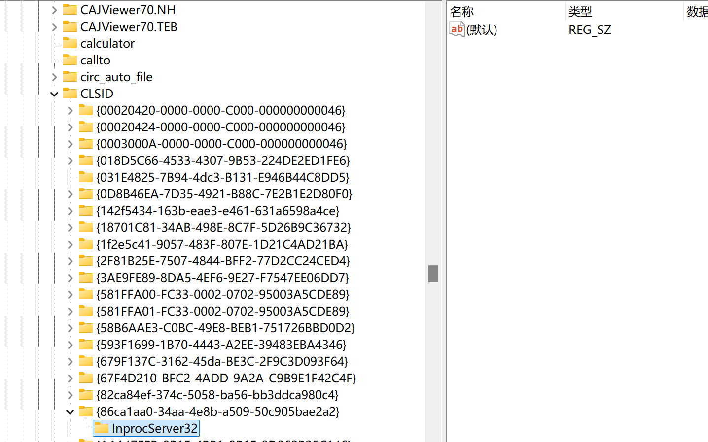

> **Win11升级后的bug和反人类设计真的有点多，根据平常使用记录下有用的修改**

## 一.将鼠标右键“显示全部选项”展开

### 介绍

有三种方法，分别是

- 命令行
- 注册表
- 小工具

这里**只介绍注册表，因为其可逆操作十分方便**。命令行、小工具等可见[此处](#参考1)

### 注册表实现

1. win+r，输入“regedit”，打开注册表

2. 跟踪到“HKEY_CURRENT_USER\SOFTWARE\CLASSES\CLSID”目录

3. 右键“CLSID”,**在该目录下新建名为**

   **“{86ca1aa0-34aa-4e8b-a509-50c905bae2a2}“的项（注意带上{}）**

4. 在刚刚新建的项中，**再新建一个名为“InprocServer32”的项**

5. 然后选择“InprocServer32”项，双击右侧窗格中的默认条目，无需输入

6. 然后保存退出（无保存键，直接退出）

成功后如下图

最后打开“任务管理器”，**重启“Windows 资源管理器”**

然后就能看到修改成功了~~

### 参考

- [如何重启explorer.exe](https://zhuanlan.zhihu.com/p/477779512)
- [win11右键如何显示更多选项](https://blog.csdn.net/chenyongxyzg/article/details/136923262)
