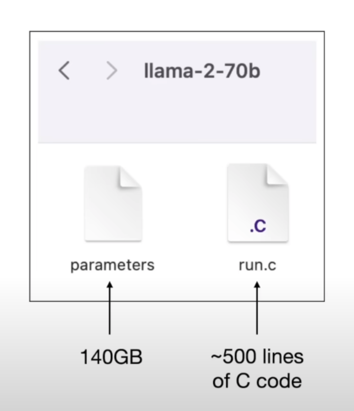
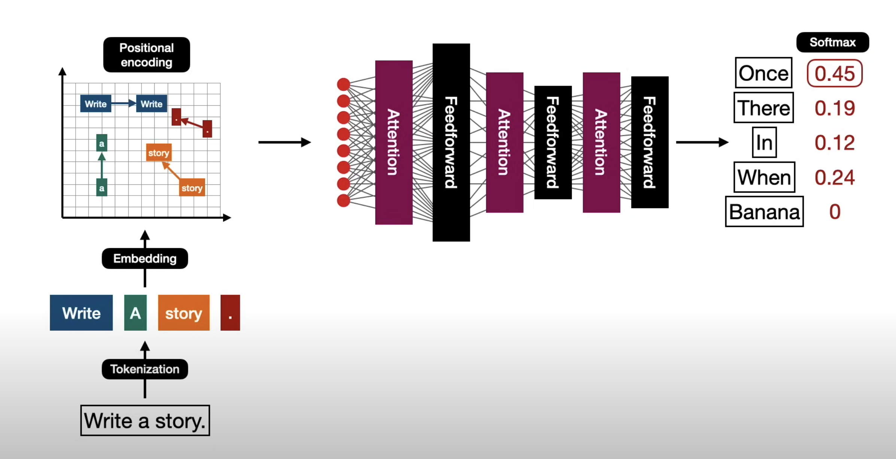
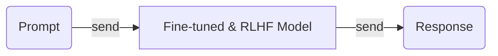
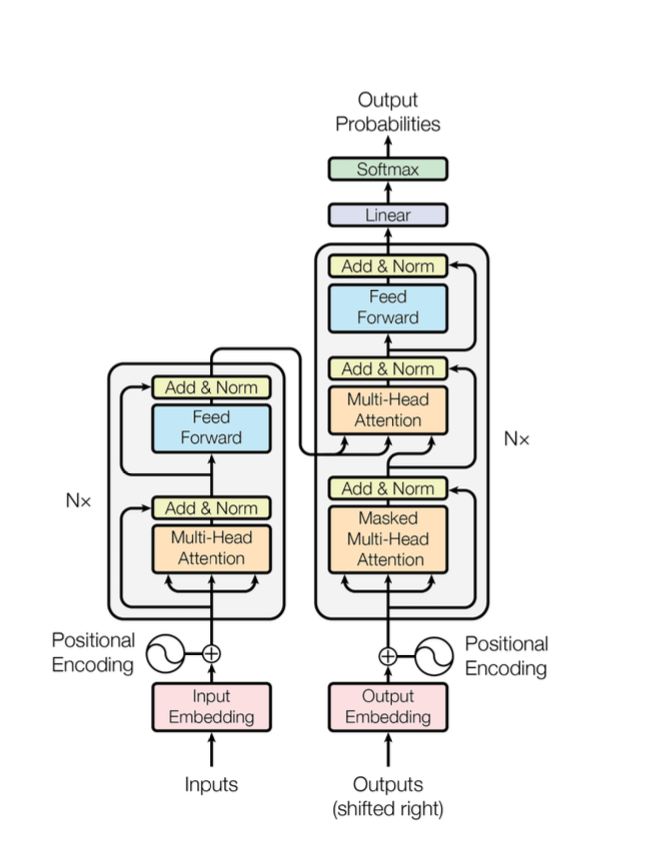
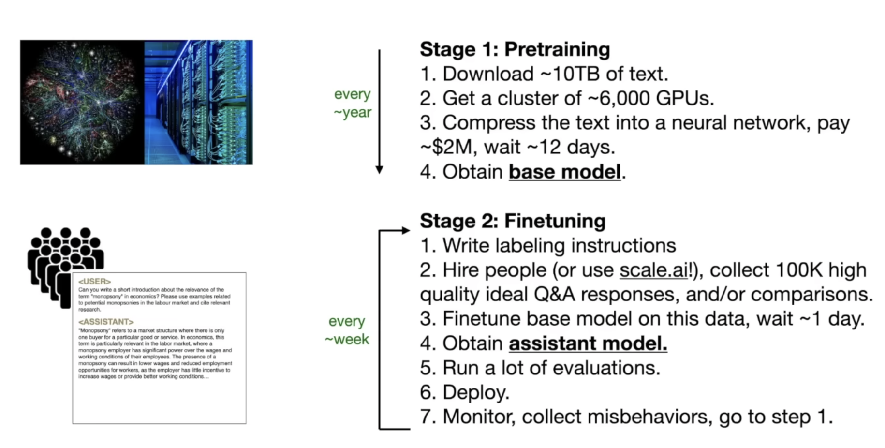
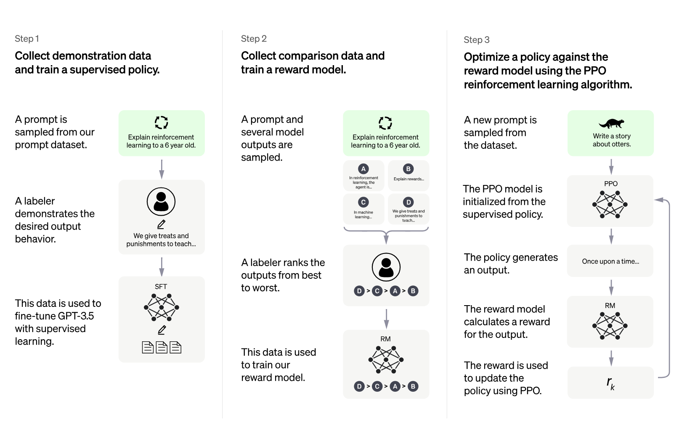
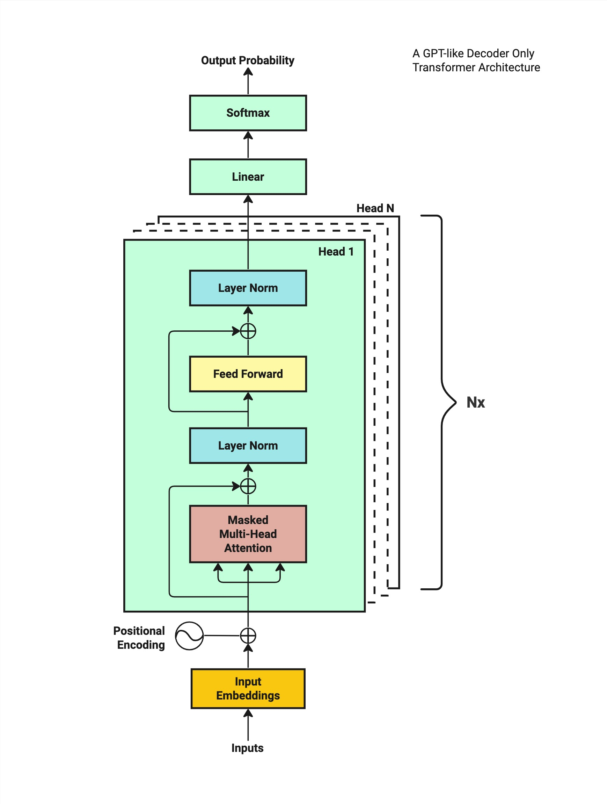

## What’s LLM？

### 基本概念

> WIKI：A large language model (LLM) is a language model notable for its ability to achieve general-purpose language understanding and generation. LLMs acquire these abilities by learning statistical relationships from text documents during a computationally intensive self-supervised and semi-supervised training process. LLMs are artificial neural networks following a transformer architecture.

LLM通过海量数据来训练模型（理解能力comprehense），能对不同的输入生成相应文本（生成能力generate）

#### 特点

1. parameters 海量参数，参数越多模型效果一般越好。

   如GPT3是175百万，GPT4是1万亿

2. 高成本 训练所需资金大

### 看看模型？

模型实际上就是二进制文件

下方左边是模型参数文件，右边是推理程序，用来查询模型

> 右边程序具体是什么，查询什么？

### 模型推理

基本流程：

> **推理**：选取概率最高的。
>
> 训练中，会生成概率集，例：我想吃 苹果(0.6)/橙子(0.3)/香蕉(0.1)，那么概率集为{苹果，橙子，香蕉}，按照概率排序。

从这里来看，最开始的大语言模型，是将“查询数据库”的功能放到了训练中，通过训练得出概率集。

### 模型架构

模型训练过程（粗略）

---

## How LLM Works?

主要是两个模型 **document completer和document generator**

#### Document Completer 文档补全器

文档补全的流程大致如下

提问后，模型只会以固定形式进行回复。

例如 提问“a banana is” 回答 “an elongated edible fruit”

#### Document Generator 文档生成器

文档生成器的流程大致如下

提问后，模型会近似人类的思维进行回复。

例如，提问“I want to buy a car” 回答 “what kind of car do you want to buy”

#### 区别

文档补全器completer只会根据训练得到可能性最高的结果进行回答，这种模型也被称为**Base model**

文档生成器generator的反应更像人类，会依据问题进行回复，这种模型被称为**ChatGPT model**

事实上，**ChatGPT**模型可能99%都是base model，但通过额外步骤的训练：**fine-tuning**和**reinforcement learning from human feedback**,即**微调**和**人类反馈**，表现更好。

### Pre-training: Base Model

基于Base的预训练是AI革命的核心。

> 所谓训练模型：就是喂大量数据让模型自行学习的过程。需要**大量数据和海量计算资源GPU TPU**

transformer架构训练模型的流程如下

里面一些关键技术：

- tokenization 分词：文本转化为机器可处理形式
- embedding 嵌入：离散的token映射到固定维度的向量空间，包括语义信息
- position encoding 位置编码：序列中每个token位置信息添加到嵌入向量中
- feed-forward 前馈：前馈网络时简单的神经网络，数据从输入层依次传递到输出层（中间可能经过多个隐藏层）
- normalization 归一化：数据预处理技术，调整数据的尺度。使其具有0均值和单位方差
- softmax 激活函数：将K为实数向量转换为一个K维的概率分布向量。值在(0,1)，和为1
- linear transformation 线性变化
- multi-head attention 多头注意

### Fine-tuning:Train the Assistant

过程：人工创造大量对话喂给模型

结构：模型基于上下文相关进行回复的概率提高。

> 到这一步，仍然可以称呼该模型为“**专家模型**”

下图是从预训练到微调的步骤

### RLHF:Reinforcement Learning from Human Feedback

[OpenAI对模型的介绍](https://openai.com/index/instruction-following/)

下图是基于人类反馈的强化学习步骤

不是构建百万的Q&A对，而是rank用户的提问和模型的回答，更符合人类回答的将排在前方。通过奖励模型将rank反馈给模型，更新迭代

一个有意思的对比如下图

| prompt:           | *Explain the moon landing to a 6 year old in a few sentences.* |
| ----------------- | ------------------------------------------------------------ |
| `Base`            | *Explain the theory of gravity to a 6 year old.*             |
|                   | *Explain the theory of relativity to a 6 year old in a few sentences.* |
|                   | *Explain the big bang theory to a 6 year old.*               |
|                   | *Explain evolution to a 6 year old.*                         |
| `Fine-tuned/RLHF` | *People went to the moon, and they took pictures of what they saw, and sent them back to the earth so we could all see them.* |

### Prompt Engineering

除了fine-tune和RLHF，问题输入也很关键。这涉及到**提示工程，Prompt Engineering**。

有时候需要设计提示才能让模型正确回答（在不对模型进行微调或RLHF时），类似人工提供例子诱导模型进行推理。

---

## Core：Transformer Architecture

首次介绍Transformer模型见该[文章](https://arxiv.org/abs/2005.14165)

### High Level Overview

起初只是在训练语言翻译模型，意外发现transformer架构在符号预测上表现极好。在随后的互联网海量数据的训练中，其对文本的理解能力以及完成句子的能力，更贴近人类。

transformer由两个部分组成：**encoder 编码器 和decoder 解码器**

**编码器**：擅长从文本提取信息，用于分类和回归任务

**解码器**：擅长生成长文本。（GPT就是decoder-only）

下图是decoder-only的训练过程

流程简单说明如下

| 步骤 | 内容                                                         |
| ---- | ------------------------------------------------------------ |
| 1    | 训练文本输入，这些输入会被转化为向量嵌入格式                 |
| 2    | 对每个向量嵌入添加位置编码，捕捉字符在序列中的位置           |
| 3    | 模型对输入进行一系列的计算，最终生成给定输入文本的下一个可能字符的概率分布 |
| 4    | 将预测结果和训练数据的实际内容进行对比，修正权重             |
| 5    | 模型最终不断迭代更新参数，提高预测准确性                     |

[什么是向量嵌入？](https://www.elastic.co/cn/what-is/vector-embedding)

下面对各个步骤详细解释

### Step1:Tokenization 

> **步骤1：分词**
>
> 目的是：**将输入的句子转化成数字表示的格式**

会将长句子**拆分**成更小单元，如单词、短语或字符。

例如

> Chapter 1: Building Rapport and Capturing

首先被拆分为

> ‘Chapter’,’ ’,’1’,’:’,’ ’,‘Building’,’Rap’,’port’,’ ’,’and’,’ ’,’Capturing’

随后分别被tokenized为10个数字

> [26072, 220, 16, 25, 17283, 23097, 403, 220, 323, 220, 17013, 220, 1711]

tokenize完成后，就可以用**整数索引(integer indices)**作为标记，而不是整个词。

### Step2:Word Embedding 

> **步骤2：词嵌入**
>
> 目的是：**将词语转换为低维的连续向量表示，以捕捉词语之间的语义关系和相似性，便于机器学习进行数据处理**

下表是**标记嵌入查找表(Token Embedding Look-up Table.)**

|        | 0         | 1         | 2         | ···  | 61        | 62        | 63        |
| ------ | --------- | --------- | --------- | ---- | --------- | --------- | --------- |
| 0      | 0.625765  | 0.025510  | 0.954514  |      | 1.473840  | 0.068826  | 1.332708  |
| 1      | -0.497006 | 0.465756  | -0.257259 |      | -0.693927 | -0.325247 | 1.243933  |
| 2      | 1.347121  | 1.690980  | -0.124446 |      | -0.978587 | -0.432050 | -1.493750 |
| ···    |           |           |           |      |           |           |           |
| 100066 | -0.436116 | 0.450023  | -1.381522 |      | -0.279772 | 1.522029  | -0.629672 |
| 100067 | 0.147102  | 0.578953  | -0.668165 |      | -1.064455 | 1.290440  | -1.110520 |
| 100068 | 0.415268  | -0.345575 | 0.441546  |      | 1.333426  | 0.372255  | 0.722526  |

行代表整数索引，每一行即为一个标记（可以为字符、单词）和其嵌入向量表示

列代表不同维度，从模型训练的角度来看这是参数，用来标记语义信息；从理解角度来说，一个单词的可以有名词、动词、形容词等多个维度来。

从Tokenization到Word embedding，关键转化在于将下面这样分词后的标记

> [26072, 220, 16, 25, 17283, 23097, 403, 220, 323, 220, 17013, 220, 1711] 

 转化成 **word embedding look-up table**

> **这里面各个维度的参数如何确定？**
>
> 反向传播和优化步骤优化参数

### Step3:Positional Encoding

> **步骤3：位置编码**
>
> 目的是：****

### Step4:Transformer Block

### Step5:Residual Conection and Layer Normalization

### Step6:Feed-Forward Network

### Step7:Repeat Step 4 to 6

### Step8:Output Probablities

